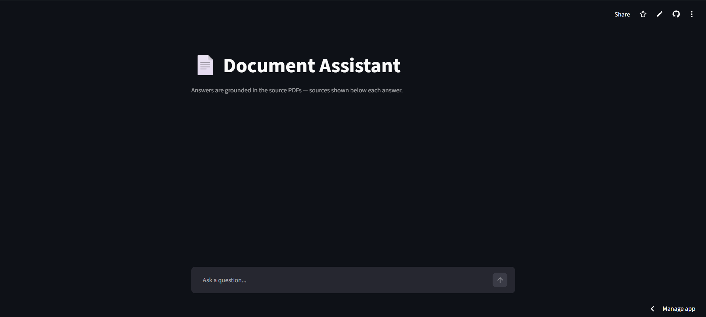

# [AI Research Paper Assistant]

An AI chatbot that answers questions about foundational AI research papers using Retrieval-Augmented Generation (RAG) — built with the very technique the knowledge base describes. Answers are grounded strictly in the source PDF documents, with page-level citations — if the answer isn't in the documents, the bot says so instead of guessing.

Sources:
1. Attention Is All You Need (Transformers) — arxiv.org/pdf/1706.03762
2. The RAG paper (Retrieval-Augmented Generation) — arxiv.org/pdf/2005.11401
3. LoRA (efficient fine-tuning) — arxiv.org/pdf/2106.09685
4. InstructGPT (RLHF / why chatbots follow instructions) — arxiv.org/pdf/2203.02155.
5. Chain-of-Thought Prompting — arxiv.org/pdf/2201.11903

**🔗 Live demo:** [PASTE YOUR STREAMLIT URL AFTER STEP 4.5]



## How it works

```
PDFs → chunked (1000 chars, 150 overlap) → embedded (gemini-embedding-001)
     → stored in Chroma → top-4 retrieval per query → Gemini 2.5 Flash
     → grounded answer + source citations
```

1. **Ingestion** (`ingest.py`) — loads every PDF in `docs/`, splits the text
   into overlapping chunks, converts each chunk into embeddings, and persists
   them in a local Chroma vector store.
2. **Retrieval** — each user question is embedded with the same model and the
   4 most semantically similar chunks are fetched.
3. **Generation** (`app.py`) — the chunks are injected into a prompt that
   instructs Gemini to answer **only** from the provided context, and the UI
   displays which PDF and page each answer came from.

## Tech stack

- **LangChain** (LCEL) — retrieval pipeline orchestration
- **Google Gemini** — `gemini-embedding-001` embeddings + `gemini-2.5-flash` generation
- **Chroma** — local vector store
- **Streamlit** — chat interface
- **pypdf** — PDF parsing

## Run it locally

```bash
git clone https://github.com/[YOUR_USERNAME]/rag-chatbot.git
cd rag-chatbot
python -m venv venv
venv\Scripts\activate          # Windows (macOS/Linux: source venv/bin/activate)
pip install -r requirements.txt

# Add your key: create a .env file containing
# GOOGLE_API_KEY=your_key_here   (free at aistudio.google.com)

python ingest.py               # build the knowledge base from PDFs in docs/
streamlit run app.py           # open localhost:8501
```

To use your own documents, drop PDFs into `docs/` and re-run `python ingest.py`.

## What I learned building this

- Designing a RAG pipeline end-to-end: chunking strategy, embedding models,
  vector retrieval, and grounded prompting to prevent hallucination
- Migrated embeddings from the deprecated `text-embedding-004` to
  `gemini-embedding-001` mid-project (768 → 3072 dimensions), which required
  rebuilding the vector store — embedding models must match between indexing
  and querying